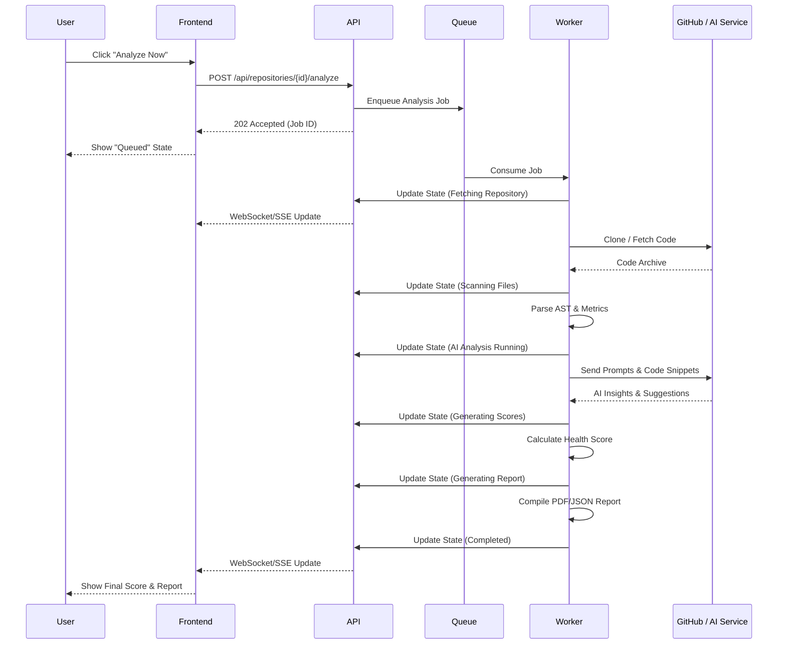

# Repository Analysis Workflow

## 1. High-Level Workflow
The repository analysis workflow is the core engine of DevLens AI. It is an asynchronous process designed to take a given Git repository, fetch its contents, analyze its architecture and code quality using AI, and generate a comprehensive health score and report.

## 2. User Journey
1. **Trigger:** The user clicks the "Analyze Now" button on a repository card or details page.
2. **Feedback:** The UI immediately reflects a "Queued" or "Analyzing" state, providing visual feedback that the request was received.
3. **Observation:** The user can monitor the progress through a progress bar or step indicator showing the current state (e.g., "Scanning Files").
4. **Completion:** Upon successful completion, the UI updates with the new Health Score and makes the detailed report available for viewing.
5. **Notification:** If the user navigated away, an in-app notification alerts them that the analysis is complete.

## 3. System Workflow
1. **API Request:** Frontend sends an HTTP POST request to trigger analysis.
2. **Job Queue:** Backend validates the request and enqueues a background job (e.g., using Redis/RabbitMQ).
3. **Worker Execution:** A background worker picks up the job and begins processing the states sequentially.
4. **Real-time Updates:** The worker publishes state changes to a pub/sub channel.
5. **Client Sync:** The frontend listens via WebSockets or Server-Sent Events (SSE) to receive state updates and progress percentages.

## 4. Sequence Diagram

## 5. States
The analysis pipeline transitions through the following discrete states:
*   **Idle:** Default state when no analysis is running.
*   **Queued:** The job has been submitted and is waiting for an available worker.
*   **Fetching Repository:** The worker is cloning or downloading the repository source code from the provider (e.g., GitHub, GitLab).
*   **Scanning Files:** The system is statically analyzing the codebase, parsing ASTs, calculating cyclomatic complexity, and identifying dependencies.
*   **AI Analysis Running:** The core AI engine is reviewing code snippets for anti-patterns, security vulnerabilities, and architectural improvements.
*   **Generating Scores:** Aggregating static metrics and AI insights to calculate the final Health Score (0-100).
*   **Generating Report:** Compiling the findings into a structured format (JSON) and a downloadable PDF report.
*   **Completed:** The workflow finished successfully. Results are persisted to the database.
*   **Failed:** The workflow encountered a non-recoverable error.
*   **Cancelled:** The user manually aborted the process before completion.

## 6. Retry Behavior
*   **Transient Errors:** Network timeouts (e.g., during GitHub clone or AI API calls) trigger automatic retries with exponential backoff (e.g., 3 retries max).
*   **Permanent Errors:** Syntax errors in unsupported languages, repository not found (404), or permission denied (401/403) fail immediately without retries.
*   **Idempotency:** Re-running an analysis overwrites or versions the previous analysis data without duplicating core repository records.

## 7. Error Handling
*   **Timeouts:** If any state exceeds its maximum allocated time (e.g., AI Analysis takes > 10 minutes), the job is aborted and marked as `Failed` with a timeout reason.
*   **Dead Letter Queue (DLQ):** Failed jobs are sent to a DLQ for manual inspection and debugging by administrators.
*   **User Visibility:** Errors are exposed to the user with actionable messages (e.g., "Failed to fetch repository. Please check your GitHub access token.").

## 8. Progress Tracking
Progress is tracked both by state transitions and a granular percentage (0-100%). Different states contribute differently to the overall progress based on expected duration:
*   Queued: 0%
*   Fetching Repository: 10%
*   Scanning Files: 30%
*   AI Analysis Running: 70%
*   Generating Scores: 85%
*   Generating Report: 95%
*   Completed: 100%

## 9. Notifications
*   **In-App:** A toast notification or notification center badge appears when an analysis completes or fails.
*   **Email:** If the analysis takes longer than a predefined threshold, the system sends an email summary to the user upon completion, containing the Health Score and a link to the dashboard.
*   **Webhooks:** Future support for outbound webhooks to notify external systems (e.g., CI/CD pipelines, Slack).

## 10. Future Scalability Considerations
*   **Distributed Tracing:** Implementing OpenTelemetry to trace requests across the API, Queue, and Workers for bottleneck identification.
*   **Serverless Workers:** Migrating workers to Serverless environments (e.g., AWS Lambda, Google Cloud Run) for elastic scaling during peak loads (e.g., thousands of concurrent repository analyses).
*   **Caching AI Prompts:** Caching identical code snippet analysis results using a semantic cache to reduce AI provider costs and speed up execution.
*   **Chunking Large Repositories:** Implementing a MapReduce pattern where very large codebases are chunked and analyzed in parallel by multiple workers.
