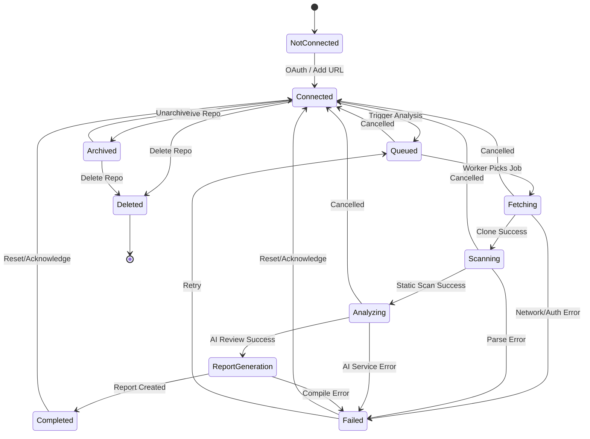
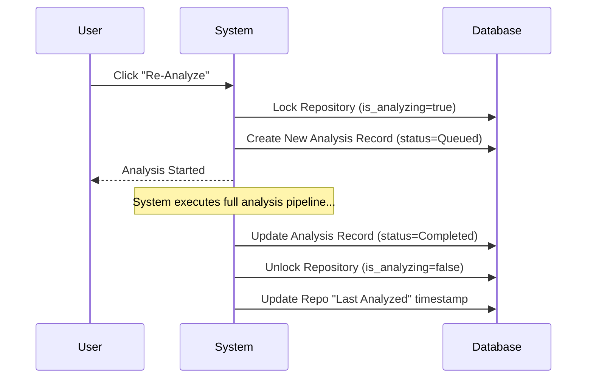

# Repository Lifecycle

## 1. Repository Onboarding Flow
The onboarding flow defines how a repository enters the DevLens AI system:
1. **Discovery:** The user connects their GitHub/GitLab account and selects a repository, or manually inputs a public repository URL.
2. **Registration:** The backend validates accessibility and creates a base `Repository` record with the initial state `Connected`.
3. **Initial Analysis (Optional):** The system prompts the user to trigger the first analysis, pushing the state to `Queued`.

## 2. Supported Repository States

| State | Description |
| :--- | :--- |
| **Not Connected** | The repository exists on the provider but hasn't been authorized in DevLens. |
| **Connected** | The repository is registered in DevLens but currently idle (no active analysis). |
| **Queued** | An analysis job is submitted and awaiting an available worker. |
| **Fetching** | The worker is downloading/cloning the repository source code. |
| **Scanning** | Performing static analysis and extracting metrics. |
| **Analyzing** | Sending code chunks to the AI engine for intelligent review. |
| **Report Generation** | Aggregating results and generating the final report object. |
| **Completed** | The analysis successfully finished. Repository returns to an idle/ready state. |
| **Failed** | The analysis encountered an unrecoverable error. |
| **Archived** | The repository is no longer actively monitored, but historical data remains. |
| **Deleted** | The repository and all its analysis history are purged from the system. |

## 3. State Transition Diagram

## 4. Allowed Transitions
| Current State | Target State | Trigger Condition |
| :--- | :--- | :--- |
| Connected | Queued | User clicks "Analyze" or webhook triggers. |
| Queued | Fetching | Worker accepts job. |
| Any Active (Fetching-ReportGeneration) | Connected | User clicks "Cancel". |
| Any Active (Fetching-ReportGeneration) | Failed | Fatal exception thrown. |
| Completed / Failed | Connected | Analysis acknowledged; repo goes idle. |
| Connected | Archived / Deleted | User manages repository settings. |

## 5. Invalid Transitions
*   **Scanning -> Queued:** Once an analysis starts, it cannot move backwards to the queue.
*   **Archived -> Queued:** An archived repository cannot be analyzed until it is unarchived (`Connected`).
*   **Completed -> Scanning:** Must go through `Queued` and `Fetching` for a fresh run.
*   **Deleted -> Any:** Deletion is terminal.

## 6. Retry Strategy
*   **Automated Retries:** Network timeouts during `Fetching` or `Analyzing` automatically retry up to 3 times with exponential backoff.
*   **Manual Retries:** If a job enters the `Failed` state, the user can manually click "Retry", pushing the repository back to `Queued`.
*   **Idempotency Key:** Retries use the same Job ID to prevent creating duplicate analysis history records.

## 7. Cancellation Rules
*   **Graceful Cancellation:** If cancelled during `Queued`, `Fetching`, or `Scanning`, the job is discarded, and temporary files are cleaned up immediately.
*   **Hard Cancellation:** If cancelled during `Analyzing`, active AI API requests are orphaned (or cancelled if the provider supports cancellation tokens), and the worker stops processing.
*   **Post-Cancellation:** The state reverts to `Connected`, and a cancelled log entry is created.

## 8. Re-Analysis Flow

## 9. Version History Strategy
*   Every successful analysis creates an immutable `AnalysisReport` record linked to the specific Git Commit Hash (SHA).
*   The `Repository` model tracks the `latest_analysis_id`.
*   Users can view a timeline comparing the Health Score across different commits/dates to track degradation or improvement.

## 10. Analysis History Retention
*   **Free Tier:** Retain the last 5 analysis reports or 30 days of history.
*   **Pro Tier:** Retain unlimited history for 1 year.
*   **Purge:** Old reports are moved to cold storage (e.g., AWS S3) and eventually purged based on retention policies.

## 11. Concurrent Analysis Rules
*   **One Active Job:** A single repository can only have **one** active analysis running at a time.
*   If a webhook or user attempts to trigger an analysis while one is already `Queued` or `Analyzing`, the request is rejected with a `409 Conflict` (or safely ignored if automated).

## 12. Locking Strategy
*   **Distributed Lock:** Redis is used to lock the repository ID when an analysis begins.
*   **Lock TTL:** The lock has a Time-To-Live (TTL) equal to the maximum allowed analysis duration (e.g., 30 minutes). If the worker crashes, the lock expires automatically, preventing deadlocks.
*   **Unlock:** The lock is explicitly released when the state reaches `Completed`, `Failed`, or is `Cancelled`.

## 13. Error Recovery
*   **Zombie Jobs:** A cron job sweeps the database for analyses stuck in an active state longer than the TTL. These are marked as `Failed` (Timeout).
*   **Orphaned Files:** Workers utilize temporary directories for cloning. On success, failure, or crash recovery, a cleanup script recursively deletes the workspace to prevent disk space exhaustion.

## 14. Notifications
*   **State Change Events:** Every state transition emits an event to a WebSocket/SSE channel for real-time frontend updates.
*   **Completion Alerts:** When transitioning to `Completed` or `Failed`, the system dispatches an email or Slack notification based on user preferences.

## 15. Future Scalability
*   **Branch-Level Lifecycle:** Currently, the lifecycle implies the `main`/`master` branch. Future iterations will support parallel lifecycles for pull requests (PRs) without locking the main branch.
*   **Differential Analysis:** Instead of a full `Scanning` phase every time, future workers will only scan and analyze the diff between the current commit and the last analyzed commit to drastically reduce `Analyzing` time and AI token costs.
