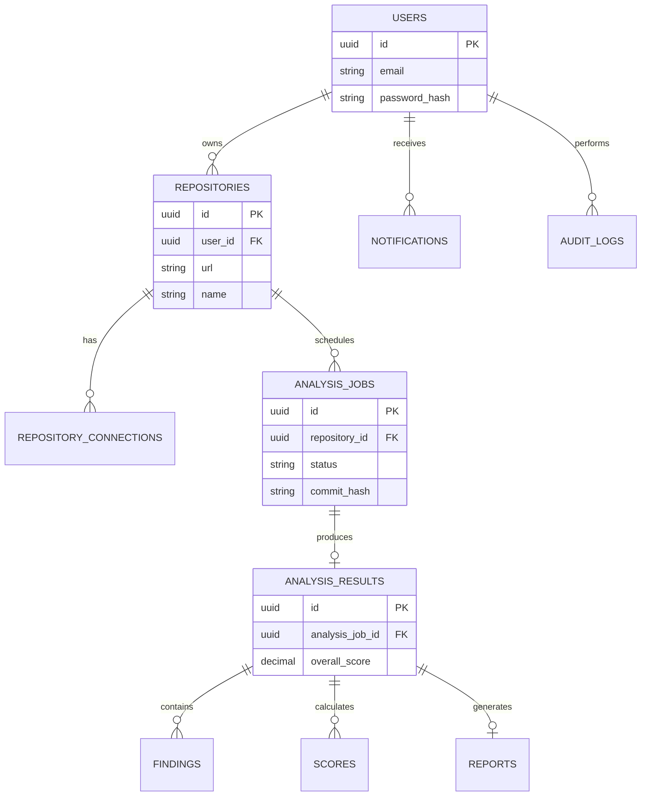

# Database Design

This document outlines the PostgreSQL database schema for DevLens AI. It focuses on scalability, auditability, and data integrity for the core repository analysis engine.

## 1. Core Architecture Decisions

### UUID Strategy
All tables use `UUID` (v4) for their Primary Keys instead of sequential integers. This prevents enumeration attacks (e.g., guessing user or repository IDs) and simplifies distributed ID generation across microservices.

### Soft Delete Strategy
To prevent accidental data loss and maintain historical referential integrity, no records are hard-deleted. Every table includes standard audit timestamps:
*   `created_at` (TIMESTAMP DEFAULT NOW())
*   `updated_at` (TIMESTAMP DEFAULT NOW())
*   `deleted_at` (TIMESTAMP NULL) - A non-null value indicates the record is logically deleted.

### Audit Fields
Crucial tables include `created_by` and `updated_by` fields pointing to the User ID responsible for the change, ensuring full traceability.

### Normalization (3NF)
The schema is normalized to the Third Normal Form (3NF) to eliminate data redundancy and ensure data dependencies make sense. For example, `Findings` and `Scores` are separated from `AnalysisResults` into their own tables. This prevents update anomalies and ensures that an analysis result only stores metadata about the run, while the specific scores and findings are linked via foreign keys.

---

## 2. Mermaid ER Diagram



---

## 3. Entity Definitions

### 3.1 Users
**Purpose:** Stores registered user accounts and authentication credentials.
*   **Primary Key:** `id` (UUID)
*   **Columns:** `email` (VARCHAR), `password_hash` (VARCHAR), `full_name` (VARCHAR), `role` (VARCHAR)
*   **Foreign Keys:** None
*   **Indexes:** `idx_users_email` (UNIQUE)
*   **Constraints:** `email` must be valid format, `role` IN ('USER', 'ADMIN')

### 3.2 Repositories
**Purpose:** Stores metadata about Git repositories connected to DevLens AI.
*   **Primary Key:** `id` (UUID)
*   **Columns:** `user_id` (UUID), `url` (VARCHAR), `name` (VARCHAR), `default_branch` (VARCHAR), `visibility` (VARCHAR)
*   **Foreign Keys:** `user_id` -> `Users.id`
*   **Indexes:** `idx_repositories_user_id`
*   **Constraints:** `visibility` IN ('PUBLIC', 'PRIVATE')

### 3.3 RepositoryConnections
**Purpose:** Stores sensitive OAuth tokens or Personal Access Tokens (PAT) securely.
*   **Primary Key:** `id` (UUID)
*   **Columns:** `repository_id` (UUID), `provider` (VARCHAR), `encrypted_token` (VARCHAR), `expires_at` (TIMESTAMP)
*   **Foreign Keys:** `repository_id` -> `Repositories.id`
*   **Indexes:** `idx_repo_conn_repo_id`
*   **Constraints:** `provider` IN ('GITHUB', 'GITLAB', 'BITBUCKET')

### 3.4 AnalysisJobs
**Purpose:** Tracks the state and metadata of an analysis run.
*   **Primary Key:** `id` (UUID)
*   **Columns:** `repository_id` (UUID), `status` (VARCHAR), `commit_hash` (VARCHAR), `started_at` (TIMESTAMP), `completed_at` (TIMESTAMP)
*   **Foreign Keys:** `repository_id` -> `Repositories.id`
*   **Indexes:** `idx_analysis_jobs_repo_status` (repository_id, status)
*   **Constraints:** `status` IN ('QUEUED', 'FETCHING', 'SCANNING', 'ANALYZING', 'REPORT_GENERATION', 'COMPLETED', 'FAILED')

### 3.5 AnalysisResults
**Purpose:** Stores the final aggregated outcome of a successful analysis.
*   **Primary Key:** `id` (UUID)
*   **Columns:** `analysis_job_id` (UUID), `overall_score` (DECIMAL), `summary` (TEXT)
*   **Foreign Keys:** `analysis_job_id` -> `AnalysisJobs.id`
*   **Indexes:** `idx_analysis_results_job_id` (UNIQUE)
*   **Constraints:** `overall_score` BETWEEN 0 AND 100

### 3.6 Findings
**Purpose:** Stores individual AI recommendations, vulnerabilities, and code smells.
*   **Primary Key:** `id` (UUID)
*   **Columns:** `analysis_result_id` (UUID), `category` (VARCHAR), `severity` (VARCHAR), `priority` (VARCHAR), `title` (VARCHAR), `description` (TEXT), `file_path` (VARCHAR), `line_number` (INT)
*   **Foreign Keys:** `analysis_result_id` -> `AnalysisResults.id`
*   **Indexes:** `idx_findings_result_id`, `idx_findings_severity`
*   **Constraints:** `severity` IN ('INFO', 'LOW', 'MEDIUM', 'HIGH', 'CRITICAL')

### 3.7 Scores
**Purpose:** Stores the breakdown of scores for specific categories (e.g., Security, Architecture).
*   **Primary Key:** `id` (UUID)
*   **Columns:** `analysis_result_id` (UUID), `category` (VARCHAR), `score` (DECIMAL)
*   **Foreign Keys:** `analysis_result_id` -> `AnalysisResults.id`
*   **Indexes:** `idx_scores_result_id`
*   **Constraints:** `score` BETWEEN 0 AND 100, UNIQUE(`analysis_result_id`, `category`)

### 3.8 Reports
**Purpose:** Stores links to generated static report files (PDF/JSON) in cloud storage.
*   **Primary Key:** `id` (UUID)
*   **Columns:** `analysis_result_id` (UUID), `file_format` (VARCHAR), `storage_url` (VARCHAR), `file_size_bytes` (BIGINT)
*   **Foreign Keys:** `analysis_result_id` -> `AnalysisResults.id`
*   **Indexes:** None
*   **Constraints:** `file_format` IN ('PDF', 'JSON')

### 3.9 Notifications
**Purpose:** In-app alerts for users regarding job completion or failures.
*   **Primary Key:** `id` (UUID)
*   **Columns:** `user_id` (UUID), `type` (VARCHAR), `message` (TEXT), `is_read` (BOOLEAN)
*   **Foreign Keys:** `user_id` -> `Users.id`
*   **Indexes:** `idx_notifications_user_unread` (user_id) WHERE is_read = FALSE
*   **Constraints:** None

### 3.10 AuditLogs
**Purpose:** Immutable ledger of sensitive actions (e.g., repository deletion, token updates).
*   **Primary Key:** `id` (UUID)
*   **Columns:** `user_id` (UUID), `action` (VARCHAR), `entity_type` (VARCHAR), `entity_id` (UUID), `ip_address` (VARCHAR)
*   **Foreign Keys:** `user_id` -> `Users.id`
*   **Indexes:** `idx_audit_logs_entity` (entity_type, entity_id)
*   **Constraints:** Immutable (No UPDATE allowed via DB triggers).

---

## 4. Advanced Considerations

### History Retention & Partitioning
*   **Retention:** Historical `Findings` and `AnalysisResults` older than 1 year are purged to cold storage.
*   **Partitioning:** The `Findings` table is expected to grow exceptionally fast (hundreds of rows per analysis). It will be partitioned by `created_at` (e.g., monthly partitions: `findings_2026_01`) to ensure fast query performance on recent data and easy dropping of old data.

### Future Extensibility
*   Using a generic `Findings` table with a `category` column allows adding new analysis types (e.g., "Accessibility" or "Green Computing") without running ALTER TABLE migrations.
*   The `encrypted_token` uses application-level envelope encryption, allowing key rotation without changing the schema.

---

## 5. Examples

### Sample Rows (Findings Table)
| id | analysis_result_id | category | severity | priority | title | file_path |
| :--- | :--- | :--- | :--- | :--- | :--- | :--- |
| `uuid-1` | `res-uuid-9` | Security | CRITICAL | MUST_FIX | Hardcoded Token | `src/auth.ts` |
| `uuid-2` | `res-uuid-9` | Architecture| HIGH | SHOULD_FIX | Cyclic Dependency | `src/index.ts` |

### Example Queries

**Fetch latest analysis score for a repository:**
```sql
SELECT ar.overall_score, ar.created_at
FROM analysis_results ar
JOIN analysis_jobs aj ON ar.analysis_job_id = aj.id
WHERE aj.repository_id = 'repo-uuid-here'
  AND aj.status = 'COMPLETED'
  AND ar.deleted_at IS NULL
ORDER BY ar.created_at DESC
LIMIT 1;
```

**Get a breakdown of Critical vulnerabilities across a user's repositories:**
```sql
SELECT r.name, COUNT(f.id) as critical_issues
FROM findings f
JOIN analysis_results ar ON f.analysis_result_id = ar.id
JOIN analysis_jobs aj ON ar.analysis_job_id = aj.id
JOIN repositories r ON aj.repository_id = r.id
WHERE r.user_id = 'user-uuid-here'
  AND f.severity = 'CRITICAL'
  AND f.deleted_at IS NULL
GROUP BY r.name
ORDER BY critical_issues DESC;
```
