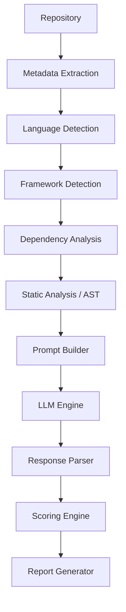

# AI Prompt Strategy

This document defines the methodology, pipeline, and structural guidelines for how DevLens AI interacts with Large Language Models (LLMs) to perform repository analysis.

---

## 1. AI Goals
The core objectives of the AI engine in DevLens AI are to:
*   **Analyze repositories** intelligently, understanding context across multiple files.
*   **Detect code quality issues** such as cyclomatic complexity, God objects, and readability flaws.
*   **Detect architecture issues** such as cyclic dependencies, layer violations, and anti-patterns.
*   **Detect security risks** including exposed secrets, injection vectors, and broken access controls.
*   **Suggest improvements** that are actionable, idiomatic to the language, and maintainable.
*   **Generate developer-friendly explanations** explaining *why* an issue exists, not just *what* it is.

---

## 2. Prompt Pipeline

The AI analysis is not a single monolithic prompt, but a staged pipeline designed to maximize context while minimizing token usage and hallucinations.



---

## 3. Prompt Structure

To ensure consistent, deterministic outputs, every prompt sent to the LLM follows a strict structural template:

1.  **System Prompt:** Defines the persona, strict rules (JSON only), and behavioral boundaries.
2.  **Developer Prompt:** Defines the specific task for this chunk (e.g., "Analyze these files for Security vulnerabilities").
3.  **Repository Context:** A highly condensed summary of the repository (languages, frameworks, key dependencies).
4.  **Analysis Instructions:** Specific metrics to look for based on the category being analyzed.
5.  **Expected JSON Output:** A strict JSON schema definition that the LLM must adhere to.

### Example System Prompt
```text
You are DevLens AI, an expert Principal Software Engineer. Your task is to perform an objective, rigorous code review on the provided code snippets.
CRITICAL RULES:
1. You MUST respond ONLY with a valid, parsable JSON object.
2. DO NOT include any markdown formatting like ```json in your response.
3. DO NOT include any conversational prose outside the JSON object.
4. Base all findings strictly on the provided code context. Do not hallucinate files, functions, or variables.
```

---

## 4. Context Rules

Feeding an entire repository into an LLM is impossible due to token limits and leads to context degradation (the "lost in the middle" phenomenon).

*   **Metadata Passing:** Global metadata (e.g., `package.json` dependencies, directory tree) is passed as a condensed text block in every prompt to provide global context without needing full source files.
*   **Selective File Analysis:** Auto-generated files (e.g., `package-lock.json`), build artifacts (`/dist`, `/build`), node_modules, and test coverage reports are actively excluded from the prompt payload via an internal `.gitignore` style filter.
*   **Chunking Strategy:** Source files are grouped logically by domain or folder. Files larger than standard token windows are chunked logically by classes or functions using AST parsing.
*   **Large Repository Strategy:** For massive repositories exceeding limits, the system employs a Map-Reduce strategy: it analyzes domain chunks in parallel (Map) and then summarizes the findings via a secondary LLM pass (Reduce) to calculate the final architecture score.

---

## 5. Output Format

The LLM is strictly constrained to output JSON. This ensures the Backend API can parse findings and pipe them directly into the PostgreSQL database.

### Expected JSON Schema Example
```json
{
  "findings": [
    {
      "category": "Security",
      "severity": "HIGH",
      "priority": "MUST_FIX",
      "title": "SQL Injection Vulnerability",
      "description": "User input from req.query.id is directly concatenated into the raw SQL string.",
      "file_path": "src/controllers/userController.ts",
      "line_number": 42,
      "confidence": 95,
      "evidence": "const query = 'SELECT * FROM users WHERE id = ' + req.query.id;",
      "recommendation": "Use parameterized queries or an ORM like Prisma to sanitize inputs automatically."
    }
  ]
}
```

---

## 6. Prompt Safety

To ensure the reliability of the analysis:
*   **Avoid Hallucinations:** The prompt explicitly instructs the LLM to provide the exact line of code ("evidence") to prove the issue exists. If the LLM cannot extract evidence directly from the provided context, it must discard the finding.
*   **Never Invent Files:** The LLM is barred from suggesting fixes in files it has not been provided in the context block.
*   **Flag Uncertainty:** The `confidence` score (0-100) requires the LLM to self-evaluate its certainty. Findings below a threshold (e.g., 60% confidence) are filtered out by the Response Parser to prevent noisy, false-positive reports.

---

## 7. Cost Optimization

LLM inference is the most expensive operational component of DevLens AI. Strategies to reduce token usage include:

*   **Caching:** A semantic cache layer (e.g., Redis) stores the hashes of analyzed code chunks. If a file hasn't changed since the last analysis, the LLM step is skipped entirely.
*   **Incremental Analysis:** During re-analysis, the system only sends the Git diff (changed lines and their immediate surrounding context) to the LLM, rather than the whole file.
*   **Token Budgeting:** Every job is assigned a strict token limit budget based on the user's subscription tier. If the budget is exceeded, the analysis gracefully prioritizes core files and truncates the rest.

---

## 8. AI Model Strategy

*   **Primary Model:** **Gemini 1.5 Pro** or **GPT-4o** for deep architectural analysis, cross-file reasoning, and complex security vulnerability detection due to their massive context windows and superior reasoning capabilities.
*   **Fallback Model:** **Gemini 1.5 Flash** or **GPT-4o-mini** for faster, cheaper tasks like summarizing READMEs, evaluating simple Code Quality metrics, or generating descriptions.
*   **Retry Policy:** If the LLM returns invalid JSON or times out, the prompt is retried up to 2 times with a slightly modified System Prompt heavily emphasizing JSON strictness.
*   **Timeout Policy:** Any single LLM API call exceeding 60 seconds is aborted, logged as a timeout, and retried.

---

## 9. Future Extensibility

*   **Multiple AI Providers:** The Prompt Builder abstracts the LLM API, allowing dynamic hot-swapping between Google Vertex AI, OpenAI, and Anthropic based on cost, latency, or API availability.
*   **Custom Prompts:** Future Pro-tier features will allow organizations to inject custom rules (e.g., "Enforce strict Clean Architecture" or "Flag any usage of the `moment.js` library").
*   **Organization-Specific Context:** Injecting internal company documentation, design systems, or API standards into the RAG (Retrieval-Augmented Generation) pipeline for highly tailored reviews.
