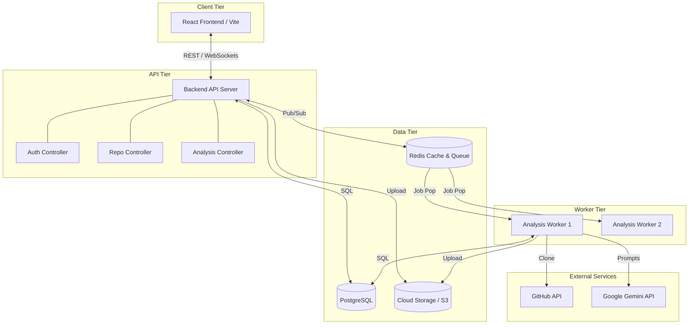
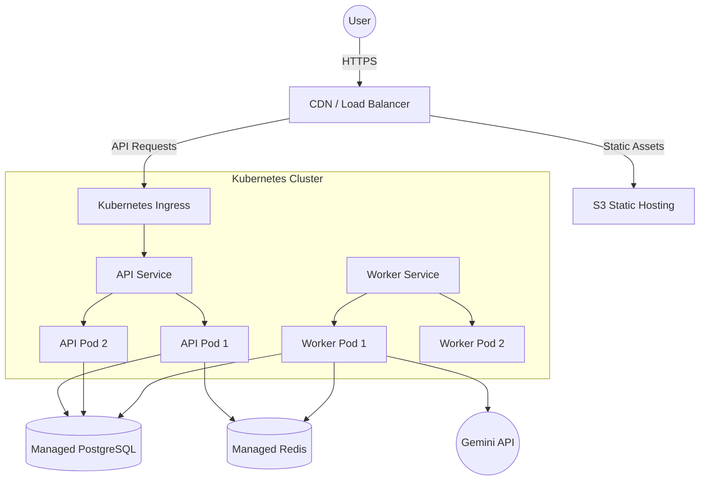
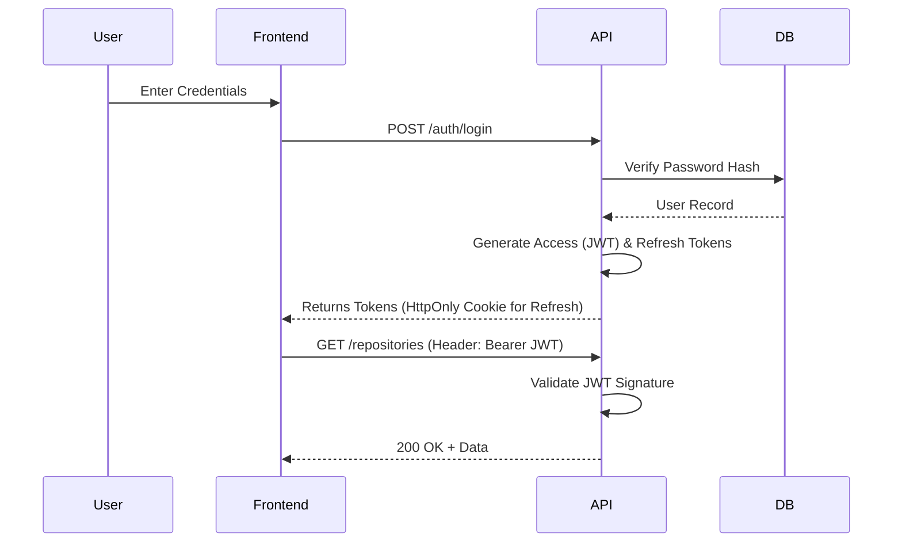
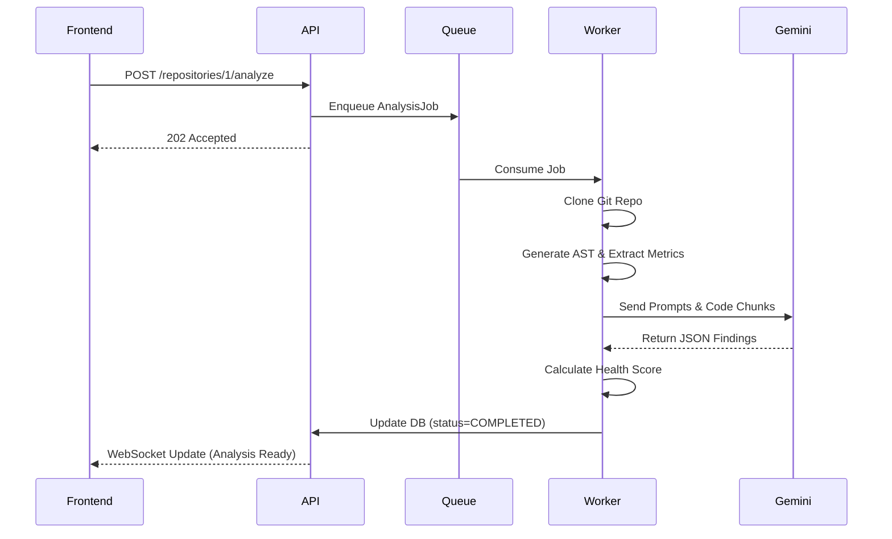

# System Architecture

This document provides a comprehensive overview of the DevLens AI system architecture, detailing the interaction between frontend clients, backend services, external providers, and data persistence layers.

---

## 1. High-Level Architecture

DevLens AI follows a modern, decoupled client-server architecture with asynchronous background processing for heavy workloads.

*   **Frontend (React):** A Single Page Application (SPA) providing the user interface, dashboards, and real-time updates.
*   **Backend (Spring Boot / Node.js):** The core API server handling authentication, business logic, and database operations.
*   **PostgreSQL:** The primary relational database for storing users, repository metadata, and analysis results.
*   **Redis (Caching & Queues):** In-memory data store used for caching API responses, rate limiting, and managing background job queues.
*   **Background Workers:** Scalable worker processes that consume jobs from Redis to perform git cloning, static analysis, and AI prompt execution.
*   **AI Providers:** External Large Language Model services (e.g., Google Gemini, OpenAI).
*   **Cloud Storage:** Object storage (AWS S3 or Cloudinary) for saving generated PDF reports and static assets.

---

## 2. Component Diagram

---

## 3. Deployment Diagram

---

## 4. Data Flow

1.  **User Request:** User submits a request (e.g., "Analyze Repo") via the React Frontend.
2.  **API Gateway:** The Load Balancer routes the request to an available Backend API pod.
3.  **State Management:** The API validates the request, updates the PostgreSQL database state to `QUEUED`, and pushes a job to Redis.
4.  **Async Processing:** An idle Background Worker pops the job from Redis and begins execution.
5.  **External Calls:** The Worker fetches code from GitHub and streams chunks to the AI Provider.
6.  **Persistence:** The Worker saves findings back to PostgreSQL and updates the job status to `COMPLETED`.
7.  **Real-Time Sync:** The API emits a WebSocket/SSE event notifying the Frontend that the analysis is ready.

---

## 5. Authentication Flow

---

## 6. Repository Analysis Flow

---

## 7. Report Generation Flow
1.  **Trigger:** Upon reaching the `COMPLETED` state, the worker triggers a report generation subroutine.
2.  **Compilation:** The worker queries all Findings and Scores for the specific run.
3.  **Rendering:** A PDF generation library (e.g., Puppeteer or PDFKit) renders the data into a formatted document based on predefined HTML/CSS templates.
4.  **Upload:** The resulting PDF is uploaded to Cloud Storage (e.g., AWS S3).
5.  **Link Storage:** The S3 URL is saved in the PostgreSQL `Reports` table, allowing the frontend to generate secure, time-limited download links.

---

## 8. Background Job Flow
The background job system utilizes Redis as a fast, reliable message broker.
*   **Queues:** Multiple queues exist based on priority (`high-priority` for explicit user clicks, `low-priority` for scheduled cron scans).
*   **Workers:** Workers are stateless and can be scaled horizontally independently of the API. If a worker crashes, the job remains in a processing state until its TTL expires, at which point it is moved to a Dead Letter Queue (DLQ) or retried.

---

## 9. External Integrations
*   **GitHub / GitLab:** Integrated via OAuth for user authentication and fetching repository source code archives.
*   **Google Gemini (Primary):** Integrated via REST API for performing AST-assisted code reviews, architectural analysis, and summary generation.
*   **OpenAI (Future Fallback):** For high-availability failover if the primary AI provider experiences an outage.
*   **Cloudinary / AWS S3:** For hosting generated PDF reports and static user avatars.

---

## 10. Security Architecture
*   **JWT & Refresh Tokens:** Short-lived access tokens (15 mins) for stateless API calls and long-lived, rotatable refresh tokens stored in secure, `HttpOnly` cookies.
*   **Role-Based Access Control (RBAC):** API Middleware validates user roles (`USER`, `ADMIN`) before allowing access to privileged endpoints.
*   **Rate Limiting:** Redis-backed rate limiters prevent API abuse and brute-force login attempts per IP and per user account.
*   **API Validation:** Strict validation schemas on all incoming JSON payloads to prevent NoSQL/SQL injection and malformed requests.
*   **Secrets Management:** API keys, database credentials, and GitHub OAuth secrets are injected securely via Kubernetes Secrets or AWS Secrets Manager. Secrets are never hardcoded.

---

## 11. Scalability Strategy
*   **Horizontal Scaling:** Both the API pods and Worker pods are stateless, allowing auto-scaling based on CPU load or Redis queue length.
*   **Queue Workers:** Separating heavy AI processing and disk I/O from the API thread ensures the web server remains highly responsive regardless of analysis load.
*   **Caching:** Read-heavy, infrequently changing endpoints (e.g., historical scores, report metadata) are cached in Redis.
*   **Async Processing:** All AI interactions and PDF generations happen asynchronously.

---

## 12. Monitoring
*   **Logging:** Structured JSON logs are aggregated into centralized logging systems (e.g., ELK Stack, Datadog).
*   **Metrics:** Prometheus scrapes metrics from API and Worker pods (e.g., queue length, response times, AI token usage, database pool utilization).
*   **Tracing:** Distributed tracing (OpenTelemetry) tracks requests across the API, Redis, and Workers to identify network bottlenecks.
*   **Error Reporting:** Tools like Sentry catch and alert engineers on unhandled exceptions in both Frontend and Backend environments.

---

## 13. Disaster Recovery
*   **Database Backups:** Automated daily snapshots of the PostgreSQL database, with Point-In-Time-Recovery (PITR) enabled.
*   **Retry Strategy:** Background jobs automatically retry on transient network failures with exponential backoff.
*   **Recovery Procedures:** In the event of an availability zone failure, Kubernetes automatically reschedules pods to healthy nodes.

---

## 14. Future Architecture
As DevLens AI matures, the architecture is designed to evolve naturally:
*   **Multi-tenant SaaS:** Implementing row-level security (RLS) in PostgreSQL to logically separate enterprise tenant data.
*   **Team Workspaces:** Introducing a `Workspaces` and `Organizations` table to allow users to invite team members and share repository access.
*   **Plugin Architecture:** Allowing developers to write custom static analysis rules or inject proprietary linting tools into the Worker pipeline before the AI phase.
