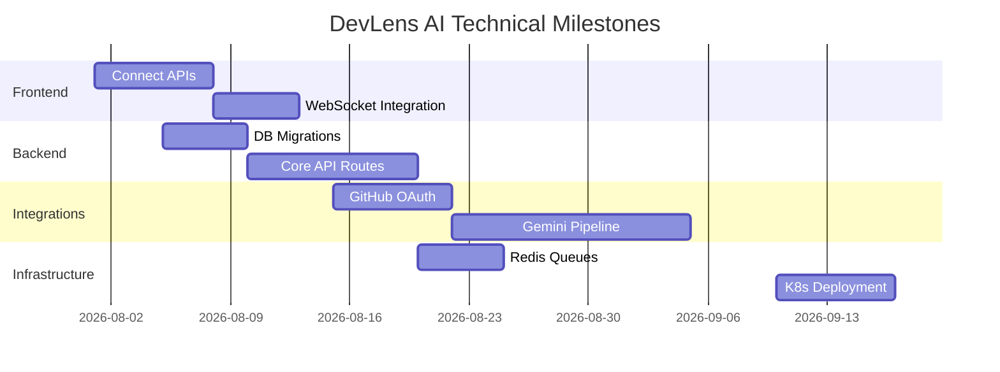

# Implementation Roadmap

This document serves as the master execution plan for the remainder of the DevLens AI project, moving from the current documentation phase into active backend and infrastructure development.

---

## 1. Development Phases & 2. Sprint Breakdown

### Phase 7: AI Analysis Frontend
*   **Objectives:** Connect existing static React components to live API endpoints (using mock data temporarily). Implement WebSockets for real-time analysis progress bars.
*   **Deliverables:** Working dashboard fetching repositories, triggering analysis, and showing progress states.
*   **Dependencies:** None (can use mocked `msw` endpoints).
*   **Risks:** State management complexity for real-time WebSocket updates.
*   **Exit Criteria:** Users can click "Analyze", watch a mock progress bar complete, and view a populated result page.

### Phase 8: Spring Boot Backend
*   **Objectives:** Stand up the core Java Spring Boot API. Implement PostgreSQL schemas using Flyway/Liquibase. Build the CRUD endpoints for Auth and Repositories.
*   **Deliverables:** Secure REST API deployed locally, connected to a local PostgreSQL instance.
*   **Dependencies:** Database Design (Sprint 6.6), API Contracts (Sprint 6.5).
*   **Risks:** Security vulnerabilities in custom JWT implementation.
*   **Exit Criteria:** Postman collection executes successfully against all `/auth` and `/repositories` endpoints.

### Phase 9: GitHub Integration
*   **Objectives:** Implement GitHub OAuth login and GitHub App installation flows. Enable the backend to clone repositories securely using temporary tokens.
*   **Deliverables:** OAuth flow working, Worker pods capable of `git clone` into ephemeral storage.
*   **Dependencies:** Phase 8 (Backend).
*   **Risks:** Handling GitHub API rate limits and large repository clone timeouts.
*   **Exit Criteria:** System successfully clones private repositories without exposing PATs in logs.

### Phase 10: AI Integration
*   **Objectives:** Integrate the Google Gemini SDK. Implement the prompt pipeline, AST extraction, and rate-limiting logic.
*   **Deliverables:** Worker successfully analyzes a codebase, scores it, and saves JSON findings to the database.
*   **Dependencies:** Phase 9 (GitHub Integration), AI Prompt Strategy (Sprint 6.7).
*   **Risks:** AI hallucinations rendering invalid JSON, breaking the pipeline.
*   **Exit Criteria:** 10 diverse sample repositories process end-to-end without parsing exceptions.

### Phase 11: Report Generation
*   **Objectives:** Build the PDF generation service using Puppeteer/PDFKit. Upload results to AWS S3.
*   **Deliverables:** Downloadable PDF reports attached to Analysis runs.
*   **Dependencies:** Phase 10 (AI Integration).
*   **Risks:** Complex CSS rendering differently in headless Chrome vs. web browsers.
*   **Exit Criteria:** Generated PDFs accurately reflect database findings and pass WCAG contrast checks.

### Phase 12: Testing
*   **Objectives:** Harden the application. Write integration tests for API, E2E tests for Frontend, and load tests for Workers.
*   **Deliverables:** High test coverage and documented performance benchmarks.
*   **Dependencies:** Phases 7-11.
*   **Risks:** Flaky E2E tests slowing down CI/CD pipelines.
*   **Exit Criteria:** All CI pipelines green. 80%+ line coverage across backend.

### Phase 13: Deployment
*   **Objectives:** Provision production infrastructure via Terraform (AWS/GCP). Set up Kubernetes clusters, CI/CD pipelines, and domain routing.
*   **Deliverables:** Live, publicly accessible application.
*   **Dependencies:** Phase 12 (Testing).
*   **Risks:** Misconfigured ingress controllers causing downtime.
*   **Exit Criteria:** Application is live at `app.devlens.ai` with valid SSL certificates.

---

## 3. Technical Milestones

---

## 4. Testing Strategy

*   **Unit Tests:** Jest (Frontend), JUnit/Mockito (Backend). Focused on isolated business logic (e.g., scoring algorithms).
*   **Integration Tests:** Testcontainers (Backend). Verifying API endpoints interact correctly with a real PostgreSQL database.
*   **E2E Tests:** Playwright or Cypress. Simulating real user flows (Login -> Connect Repo -> Analyze -> Download PDF).
*   **Performance Tests:** k6. Load testing the API with 1,000 concurrent users and stressing the background worker queue.
*   **Security Tests:** OWASP ZAP (Dynamic analysis) and Snyk (Dependency scanning) running in the CI pipeline.

---

## 5. Deployment Plan

*   **Development:** Local environments using `docker-compose` (running Postgres, Redis, API, Frontend).
*   **Staging:** Mirrored replica of production on smaller instances. Automatically deployed on merges to the `main` branch.
*   **Production:** Auto-scaling Kubernetes cluster. Deployed via manual approval in GitHub Actions following a GitOps workflow (ArgoCD).
*   **Rollback Strategy:** Blue/Green deployments allow instantaneous traffic routing back to the previous stable pod version if post-deployment health checks fail. Database rollbacks are handled via point-in-time recovery.

---

## 6. Release Plan

*   **Alpha (Internal):** Core team only. Verifying the end-to-end pipeline works on known, simple repositories.
*   **Beta (Invite-Only):** Onboarding 50 friendly developers. Stress-testing the AI prompt pipeline on diverse, messy, real-world codebases. Gathering feedback on report usefulness.
*   **v1.0 (Public Launch):** Full public availability with self-serve registration, Stripe billing integration, and marketing push.

---

## 7. Success Metrics

| Category | Metric | Target |
| :--- | :--- | :--- |
| **Performance** | API p95 Response Time | < 200ms |
| **Performance** | Max Analysis Duration (Avg Repo) | < 2 minutes |
| **Reliability** | Uptime | 99.9% |
| **Reliability** | Failed Job Rate | < 2% |
| **User Experience**| Time to First Value | < 3 minutes from Sign Up |
| **AI Accuracy** | Hallucination Rate | < 1% of total findings |

---

## 8. Risk Register

| Risk | Impact | Likelihood | Mitigation Strategy |
| :--- | :--- | :--- | :--- |
| LLM API Rate Limits | High | High | Implement exponential backoff, rotating API keys, and queue throttling. |
| AI Hallucinations | High | Medium | Strictly enforce "evidence" constraints in JSON prompts. Discard low-confidence findings. |
| Large Repo Timeouts | High | Medium | Enforce hard file size / line count limits. Skip vendor/node_modules folders. |
| DB Connection Exhaustion| High| Low | Use connection pooling (HikariCP) and scale PostgreSQL vertically as needed. |

---

## 9. Definition of Done (DoD)

*   **Per Sprint:** Code is reviewed, merged to `main`, unit tests pass, and feature is deployable to Staging.
*   **Per Phase:** All objectives met, integration tests pass, end-to-end flow verified in Staging, and documentation is updated.
*   **Overall Project:** Alpha/Beta feedback incorporated, security audit passed, infrastructure provisioned via Terraform, and successfully handling production traffic.

---

## 10. Future Roadmap

*   **v1.1 (Q4 2026):** Bitbucket/GitLab support, Webhooks for CI/CD integration, differential analysis (analyzing only PR diffs).
*   **v2.0 (Q1 2027):** Auto-remediation (AI generates Pull Requests fixing the issues it found), Custom rule engines.
*   **Enterprise Edition (Q3 2027):** On-premise deployments, Single Sign-On (SAML/Okta), Organization roll-up reporting, strict compliance reporting (SOC2/HIPAA mappings).
